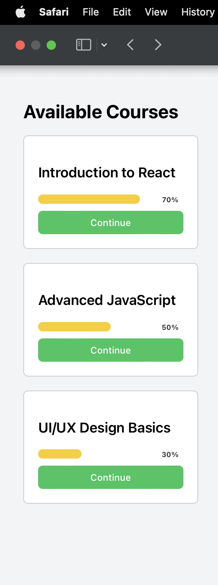

# E-LEARNING PLATFORM UI

## FEATURES

1. User-Friendly Interface with Course Listing, Progress Tracking, and Video Embedding

The platform is designed with a clean and intuitive user interface that allows learners to navigate content easily and efficiently.
A well-organized course listing enables users to browse through available courses at a glance, with clear titles, descriptions, and categories.
Each course page is thoughtfully structured to include modules, lessons, and key materials, allowing users to see their learning path clearly.
Progress tracking is seamlessly integrated into the user dashboard, showing learners how far they’ve come and what remains to be completed. This encourages continued engagement and goal-setting.
Visual indicators such as checkmarks, progress bars, or completion percentages provide clear motivation and feedback at each step.
The interface also supports video embedding, allowing course creators to incorporate high-quality educational videos directly into lesson pages.
These embedded videos load efficiently and play smoothly, enhancing the learning experience with multimedia content.
The combination of ease of navigation, visibility of progress, and multimedia integration creates an environment that supports focus, consistency, and effective learning.

2. Accessible from Any Device

The platform follows responsive design principles, ensuring that the learning experience remains consistent and fully functional across all device types — including desktops, laptops, tablets, and smartphones.
Users can switch devices without losing access to their content, progress, or user data. This flexibility supports learning on the go, which is especially important for busy learners or those in varying learning environments.
The interface and content layout automatically adapt to different screen sizes, offering an optimal viewing experience without manual adjustments.
Touch-friendly navigation and clickable areas ensure that mobile users enjoy a smooth and intuitive interaction with the platform.
The platform’s cross-device accessibility also ensures greater inclusivity, enabling users with limited access to certain technologies to still fully participate.
With no need for external software installations, the platform can be accessed directly through standard web browsers, adding to its convenience and reliability.

3. Interactive Learning Modules

To enhance engagement and reinforce understanding, the platform includes interactive learning modules as a core feature.
These modules may include quizzes, drag-and-drop activities, clickable diagrams, matching tasks, and other interactive elements that go beyond passive learning.
Interactivity promotes active participation, making the learning process more immersive and memorable.
Learners can receive instant feedback on their responses, which helps reinforce correct information and address misunderstandings immediately.
These modules are designed to cater to various learning styles, allowing users to engage with content visually, kinesthetically, and cognitively.
Interactive features also help break up long content, making it easier to digest and retain key information.
Overall, these modules increase motivation and comprehension by turning theoretical knowledge into engaging, practical application.

## OUTPUT

